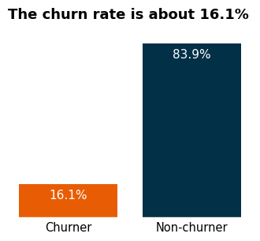

# Credit Card Churn Prediction

# 1. Description
- This is an end to end machine learning project that utilizes XGBoost to predict customer's probability of churning in a bank's credit card service. It involves supervised learning (using a labeled training set) for classification, where the target is 1 if the customer attrited, else 0.
- I implemented this project following some CI/CD principles and using modular coding. First, I developed my entire analysis (from EDA to modeling) in notebooks. Then, I divided the project development into components responsible for data ingestion, transformation, and model training, following the same steps as in the notebooks. Once I had done this, I created scripts for automating the training and prediction pipelines using these components. The training pipeline executes them and obtains all the machine learning model artifacts, while the prediction pipeline makes predictions by consuming the obtained artifacts. All of this was made with good practices like virtual environment use (isolating dependencies), exception handling, loggings, documentation (every script/function/class purposes and definitions are defined inside the files), etc. Afterward, I built a web app in Flask, integrating everything mentioned above. My objective with this was to get closer to a real data science project workflow by packaging my entire project as a package.

# 2. Technologies and tools
- The technologies and tools used were Python (Pandas, Numpy, Matplotlib, Seaborn, Scikit-Learn, Category-Encoders, Scikit-Optimize, Xgboost, Flask), Jupyter Notebook, Git and Github (version control), machine learning classification algorithms, statistics, Anaconda (terminal) and Visual Studio Code (project development environment).

# 3. Business problem and project objective
A manager at the bank is disturbed with more and more customers leaving their credit card services. They would really appreciate if one could predict for them who is gonna get churned so they can proactively go to the customers to provide them better services and turn customers' decisions in the opposite direction.

Context:

When a bank acquires a customer for its credit card service, three essential Key Performance Indicators (KPIs) to consider include:

1. Customer Acquisition Cost (CAC): This measures the expenses associated with acquiring each credit card customer, encompassing marketing, sales, and related costs. Lower CAC reflects efficient customer acquisition.
2. Customer Lifetime Value (CLV): CLV estimates the total revenue the bank can expect to generate from a credit card customer over their relationship. A higher CLV indicates that the customer's value surpasses the acquisition cost, ensuring long-term profitability.
3. Churn Rate: Churn rate is typically expressed as a percentage and represents the number of credit card customers who have left during a specific period divided by the total number of customers at the beginning of that period.

These KPIs help the bank assess the effectiveness of its strategies in acquiring credit card customers and gauge the potential long-term financial benefit of these acquisitions.

In order to maximize profitability, the bank aims to minimize CAC and Churn while maximizing CLV.

Considering this, the project objectives are:

1. Identify the factors associated with customer churn.
2. Construct a model capable of predicting as many potential churners as possible.
3. Offer action plans for the bank to reduce credit card customer churn.

When deploying the model so that the bank can make predictions, the primary objective is to generate probability scores for each customer. This is typically more valuable for businesses when compared to making binary predictions (1/0), as it enables better decision-making and more effective customer retention strategies.

For instance, predicting the probability of churn provides more actionable insights. Instead of simply determining whether a customer will churn or not, you gain an understanding of how likely it is to happen. This information enables the bank to allocate its efforts and resources more effectively. For example, it can concentrate its retention efforts on customers with a high probability of churning.

By doing this, we generate numerous benefits for the bank, such as:

1. Cost Savings
2. Improved Customer Retention
3. Enhanced Customer Experience
4. Targeted Marketing
5. Revenue Protection

And as a result, the mentioned business problem will be resolved.

# 4. Solution pipeline
The following pipeline was used, based on CRISP-DM framework:

1. Define the business problem.
2. Collect the data and get a general overview of it.
3. Split the data into train and test sets.
4. Explore the data (exploratory data analysis)
5. Data cleaning and preprocessing.
6. Model training, comparison, selection and tuning.
7. Final production model testing and evaluation.
8. Conclude and interpret the model results.
9. Deploy.

Each step is explained in detail inside the notebooks, where I provide the rationale for the decisions made

# 5. Main business insights
1. The bank presents a high churn rate. Approximately 16% of the customers churned. This motivates our project.

2. Customers who churn tend to have lower credit limits, revolving balances, transaction amounts, transaction counts, changes in transaction counts, and average utilization ratios. This makes total sense because when a client is about to discontinue the service, he will make fewer transactions, resulting in lower values of these attributes.

3. The bank must be alert to the distribution of the average utilization ratio. Being right-skewed means that most customers have a low utilization of the service. Particularly, the majority of them present zero utilization ratio. Therefore, the company must plan strategies to increase utilization and, consequently, revenue.

4. Churners tend to have fewer products from the bank.
5. Most of the customers (approximately 65% of them) contacted the bank 2 or 3 times in the last 12 months. The bank must pay attention to this and discover the reasons why customers are calling. Are they dissatisfied with the credit card service? If so, what specifically is causing their dissatisfaction? Also, when a client makes more than 5 contacts in a year, he will probably skip the service.
6. Most of the customers were inactive for 2 or 3 months in the last 12 months. Particularly, 90% of them were inactive from 1 to 3 months in this period. The bank must plan strategies not only to increase the utilization ratio, but also to avoid customer inactivity.

7. Customer age and months on book are strongly positively correlated. The older a customer is, the more time he spends consuming the bank's credit card services and vice-versa. Thus, the company must focus its efforts on retaining the old loyal customers and increase the tenure of younger ones.
8. Credit limit and average utilization ratio present an exponential decreasing relationship! This indicates that, as credit limit increases, the average utilization ratio decreases at an exponential rate. Thus, customers with higher credit limits use their credit cards less.

# 6. Modelling
1. I chose a set of models for performance comparison, analyzing the ROC-AUC score. Accuracy is not a good metric because the target is imbalanced.
2. In order to select the best model for hyperparameter tuning and final evaluation, I trained and evaluated each of the models using stratified k-fold cross-validation, which provides a more reliable performance estimate.
3. As XGBoost had the highest average validation score, I chose it for hyperparameter tuning and final model evaluation.

4. I tuned XGBoost model with Bayesian Search because it uses probabilistic models to intelligently explore the hyperparameter space, balancing exploration and exploitation. An important point here was to define a class_weight hyperparameter, such that the estimator was able to better learn the patterns in minority target class (churn customers).
5. I evaluated the results and looked at precision-recall trade-off. By dealing with this trade-off, I was able to select a threshold value that improved the recall metric from 0.94 to 0.96. However, the precision score fell down from 0.85 to 0.76.
6. Given that generating probability scores for each customer is typically more valuable for businesses than making binary predictions (1/0), as it enables better decision-making and more effective customer retention strategies, and considering that the recall increased by only 0.2 while precision decreased by 0.9, I have decided not to use the threshold for predictions and not to balance the precision-recall trade-off.
7. Anyway, the final XGBoost performance was excellent. A 0.94 recall indicates that the model correctly identifies 94% of the churners. Furthermore, a 0.85 precision indicates that, out of all customers predicted as churn, 85% of them are actually churners.

8. Although one characteristic of ensemble models like XGBoost is the lack of interpretability, it was possible to interpret and confirm that the estimator results make sense and reinforce the insights found in the EDA (Exploratory Data Analysis) step by examining feature importances. The following features clearly demonstrated discrimination between attrited and existing customers.

9. Finally, the results are excellent and the project objective was achieved. Now, the bank can access customer churn probabilities, facilitating informed decisions. This empowers strategic retention efforts and enhances decision-making.

# 7. Web app and next steps
Once I built a model that is able to identify 94% of the churners, I developed a Flask web app such that the bank can get a customer's probability of churning by giving the input features information, solving the business problem. For the next steps, I will be focused on deploying this app in a cloud like AWS (I already defined a file containing Elastic Beanstalk configuration, .ebextensions/config.py). Anyway, I describe in the next topic how you can run this project on your local machine.

Web app home page:

Web app predictions page:

# 8. Run this project on your local machine
