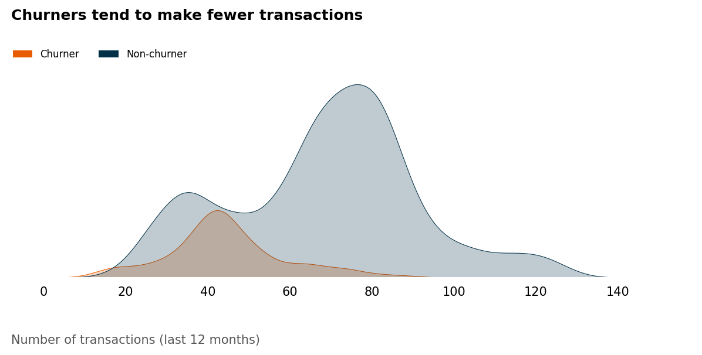
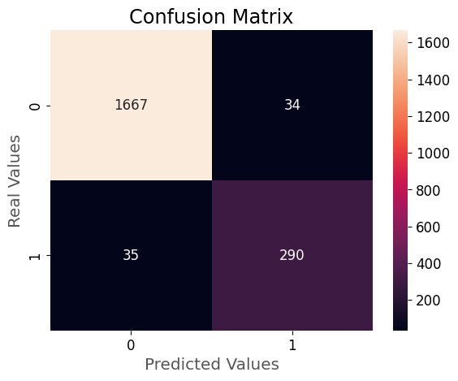
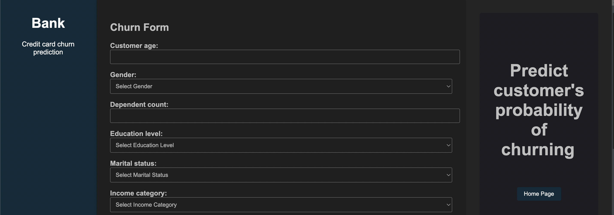

# Credit Card Churn Prediction

# 1. Description
- This is an end-to-end machine learning project that utilizes LightGBM to predict customer's probability of churning in a bank's credit card service. It involves supervised learning (using a labeled training set) for classification, where the target is 1 if the customer attrited, else 0.
- I implemented this project following some CI/CD principles and using modular coding. First, I developed my entire analysis (from EDA to modeling) in notebooks. Then, I divided the project development into components responsible for data ingestion, transformation, and model training, following the same steps as in the notebooks. Once I had done this, I created scripts for automating the training and prediction pipelines using these components. The training pipeline executes them and obtains all the machine learning model artifacts, while the prediction pipeline makes predictions by consuming the obtained artifacts. All of this was made with good practices like virtual environment use (isolating dependencies), exception handling, loggings, documentation (every script/function/class purposes and definitions are defined inside the files), etc. Afterward, I built a web app API in Flask, integrating everything mentioned above. My objective with this was to get closer to a real data science project workflow by packaging my entire project as a package.

# 2. Technologies and tools
- The technologies and tools used were Python (Pandas, Numpy, Matplotlib, Seaborn, Scikit-Learn, optuna, LightGBM, Shap, Flask), Jupyter Notebook, Git and Github (version control), machine learning classification algorithms, statistics, Anaconda (terminal) and Visual Studio Code (project development environment).

# 3. Business problem and project objective

**3.1 What is the business problem?**
- A manager at the bank is disturbed with more and more customers leaving their credit card services. They would really appreciate if one could predict for them how likely is a customer to churn so they can proactively go to the customers to provide them better services and turn their decisions in the opposite direction.

**3.2 What is the context?**
- When a bank acquires a customer for its credit card service, three essential Key Performance Indicators (KPIs) to consider include:
    1. Customer Acquisition Cost (CAC): This measures the expenses associated with acquiring each credit card customer, encompassing marketing, sales, and related costs. Lower CAC reflects efficient customer acquisition.
    2. Customer Lifetime Value (CLV): CLV estimates the total revenue the bank can expect to generate from a credit card customer over their relationship. A higher CLV indicates that the customer's value surpasses the acquisition cost, ensuring long-term profitability.
    3. **Churn Rate:** Churn rate is typically expressed as a percentage and represents the number of credit card customers who have left during a specific period divided by the total number of customers at the beginning of that period.
- These KPIs help the bank assess the effectiveness of its strategies in acquiring credit card customers and gauge the potential long-term financial benefit of these acquisitions.
- In order to maximize profitability, the bank aims to minimize CAC and Churn while maximizing CLV.

**3.3 Which are the project objectives?**
1. Identify the factors associated with customer churn.
2. Construct a model capable of accurately predicting the probability of a customer to churn.
3. Offer action plans for the bank to reduce credit card customer churn.

**3.4 Which are the project benefits?**
1. Cost Savings.
2. Improved Customer Retention.
3. Enhanced Customer Experience.
4. Targeted Marketing.
5. Revenue Protection.
- And as a result, the mentioned business problem will be resolved.

**3.5 Conclusion**
- When deploying the model so that the bank can make predictions, the primary objective is to generate probability scores for each customer. This is typically more valuable for businesses when compared to making binary predictions (1/0), as it enables better decision-making and more effective customer retention strategies.
- For instance, predicting the probability of churn provides more actionable insights. Instead of simply determining whether a customer will churn or not, you gain an understanding of how likely it is to happen. This information enables the bank to allocate its efforts and resources more effectively. For example, it can concentrate its retention efforts on customers with a high probability of churning.

# 4. Solution pipeline
The following pipeline was used, based on CRISP-DM framework:

1. Define the business problem.
2. Collect the data and get a general overview of it.
3. Split the data into train and test sets.
4. Explore the data (exploratory data analysis)
5. Feature engineering, data cleaning and preprocessing.
6. Model training, comparison, feature selection and tuning.
7. Final production model testing and evaluation.
8. Conclude and interpret the model results.
9. Deploy.

Each step is explained in detail inside the notebooks, where I provide the rationale for the decisions made

# 5. Main business insights
1. The bank presents a high churn rate. Approximately 16% of the customers churned. This motivates our project.

2. Customers who churn tend to have lower credit limits, revolving balances, transaction amounts, transaction counts, changes in transaction counts, and average utilization ratios. This makes total sense because when a client is about to discontinue the service, he will make fewer transactions, resulting in lower values of these attributes.

3. The bank must be alert to the distribution of the average utilization ratio. Being right-skewed means that most customers have a low utilization of the service. Particularly, about 25% of them present zero utilization ratio, and this is where most of the churners are located. It is a good indicator for churn event. Therefore, the company must plan strategies to increase utilization and, consequently, revenue.

5. 75% of the customers contacted the bank at least 2 times in the last 12 months. The bank must pay attention to this and discover the reasons why customers are calling. Are they dissatisfied with the credit card service? If so, what specifically is causing their 
dissatisfaction? Also, when a client makes more than 5 contacts in a year, he will probably skip the service.

6. 90% of the customers were inactive from 1 to 3 months in the last 12 months. The bank must plan strategies not only to increase the utilization ratio, but also to avoid customer inactivity.

7. The churn rate consistently increases monotonically as the number of contacts with the bank rises. Especially, all customers who made six contacts churned.

8. Customers with doctorate educational level present the highest churn rate among the other levels.

# 6. Modelling
0. I created two preprocessors. One for testing linear models, in which I applied one-hot encoding to categorical variables (linear models can leverage this encoding technique to preserve linearity assumption) and standard scaling to numerical ones (linear models are sensitive to scale because they used distance-based calculations or optimization algorithms such as gradient descent). For the tree-based models preprocessor, I applied ordinal encoding to ordinal categoric features in order to preserve this characteristic and target encoding to the reamining one. This is because one-hot encoding can be harmful for tree models, due to sparse representation and increased dimensionality. Finally, these algorithms don't require scaling, thus, numerical variables were included without any transformation. An important observation is that I performed feature engineering before preprocessing, creating a lot of relevant attributes with respect to churn discrimination. Some include average transaction amount, proportion of months inactive with respect to customer's tenure, and total spending. All these preprocessing steps were divided into transformer classes such that I could integrate everything into a sklearn's pipeline, facilitating the deployment in production environment.
1. Then, I chose a set of linear a tree-based models to comparison through stratified k-fold cross validation, analyzing the ROC-AUC score. Accuracy is not a good metric because the target is imbalanced. The objective was to select the best model for the next steps.
2. As LightGBM had the highest average validation score, I chose it for feature selection, hyperparameter tuning and final model evaluation. Although it is overfitted, it also has an outstanding performance on validation data. However, this is not due to data leakage or modeling problems, but the quality of this dataset. The set of independent variables we have clearly separates churners and non-churners.

3. I applied feature selection with the Recursive Feature Elimination (RFE) technique, which recursively select a subset of features with highest feature importances until the desired number of features is reached. As a result, 25 of the 40 variables were selected, including a lot of variables created in feature engineering step, ilustrating the importance of this task.
4. I tuned LightGBM model with Bayesian Search because it uses probabilistic models to intelligently explore the hyperparameter space, balancing exploration and exploitation. An important point here was to define a class_weight hyperparameter, such that the estimator was able to better learn the patterns in minority target class (churn customers).
5. The final LigthGBM performance was excellent. A 0.89 recall indicates that the model correctly identifies 89% of the churners. In practical terms, looking at the confusion matrix, it has accurately predicted 290 out of 325 churners. Furthermore, a 0.90 precision indicates that, out of all customers predicted as churn, 90% of them are actually churners. In practical terms, considering the confusion matrix, out of 324 customers predicted as churn, 297 of them are indeed churners. Finally, the probability scores follow an order, with churners being assigned to higher probabilities, demonstrating that the model outcomes are reliable.

| Model    | Accuracy | Precision | Recall   | F1-Score | ROC-AUC  | KS       | Gini     | PR-AUC   | Brier    |
|----------|----------|-----------|----------|----------|----------|----------|----------|----------|----------|
| LightGBM | 0.965943 | 0.895062  | 0.892308 | 0.893683 | 0.991279 | 0.898897 | 0.982559 | 0.964932 | 0.025852 |

6. Although one characteristic of ensemble models like LightGBM is the lack of interpretability, it was possible to interpret and confirm that the estimator results make sense and reinforce the insights found in the EDA (Exploratory Data Analysis) step by examining shap values. It is noticeable that lower values of transaction counts in the last 12 months have a positive impact in the log-odds of churning, and, consequently, in the probability of churning, while higher values have a negative impact. Surprisingly, higher values of average transaction amount tend to reflect a positive impact in the log-odds of churning, and, consequently, in the probability of churning, while lower values tend to have a negative impact.

# 7. Financial results
- I have estimated a baseline financial outcome to assess whether the project is worthwhile. Although I did not have access to specific data to obtain the exact financial gain, a common revenue source for credit card companies is charging fees on the outstanding balance, known as the total revolving balance, which cardholders carry from month to month. Thus, I assumed the bank's fee is 18% (a common value) and performed the estimation based on it. The calculation was derived from the difference between the true positive gain (a 10% fee charged on outstanding balances as a retention strategy), the cost of retaining false positives (an 8% discount given on outstanding balances), and the cost of false negatives churning (the entire 18% fee on outstanding balances that would have been received). Consequently, it was possible to achieve an estimated gain of $171,477, excellent! 
- Finally, the results are excellent and the project objective was achieved. Now, the bank can access customer churn probabilities, facilitating informed decisions. This empowers strategic retention efforts and enhances decision-making. Thus, the business problem is solved.

# 8. Web app and next steps
- Once I built a model that is able to accurately predict the probability of a customer to churn, I developed a Flask API web app such that the bank can get a customer's probability of churning by giving the input features information, solving the business problem. For the next steps, I will be focused on deploying this app in a cloud like AWS (I already defined a file containing Elastic Beanstalk configuration, .ebextensions/config.py). Anyway, I describe in the next topic how you can run this project on your local machine.

Logs for monitoring:

Web app home page:

Web app predictions page:

Predicted churn probability output example:

# 9. Run this project on your local machine
Prerequisites:

Before getting started, make sure you have the following installed on your machine:
- Python 3.11.4
- pip (Python package manager)
- Git (Version control tool)

Once you have this installed, open a terminal on your local machine and run the following commands:

1. Clone the repository:
<pre>
git clone https://github.com/allmeidaapedro/Churn-Prediction-Credit-Card.git
</pre>

2. Navigate to the cloned repository directory:
<pre>
cd Churn-Prediction-Credit-Card
</pre>

3. Create a virtual environment:
<pre>
python -m venv venv
</pre>

4. Activate the Virtual Environment:

Activate the virtual environment used to isolate the project dependencies.
<pre>
source venv/bin/activate  # On Windows, use 'venv\Scripts\activate'
</pre>

5. Install Dependencies:

Use pip to install the required dependencies listed in the requirements.txt file.
<pre>
pip install -r requirements.txt
</pre>

6. Run the Application:
<pre>
python application.py
</pre>

7. Access the Project Locally:

After running successfully, you can access the project locally. Open a web browser and navigate to http://127.0.0.1:5000/

Then, go to the prediction page, select the input features values and click on submit. The predicted churn probability will appear on the right side.

7. Shutdown the Application:

To stop the application, you can typically press Ctrl+C in the terminal where the application is running.

8. Deactivate the Virtual Environment:

When you're done with the project, deactivate the virtual environment.

<pre>
deactivate
</pre>

# 10. Dataset link
The dataset was collected from kaggle.

Link: https://www.kaggle.com/datasets/sakshigoyal7/credit-card-customers?sort=votes

# 11. Contact me
Linkedin: https://www.linkedin.com/in/pedro-almeida-ds/

Github: https://github.com/allmeidaapedro

Gmail: pedrooalmeida.net@gmail.com
